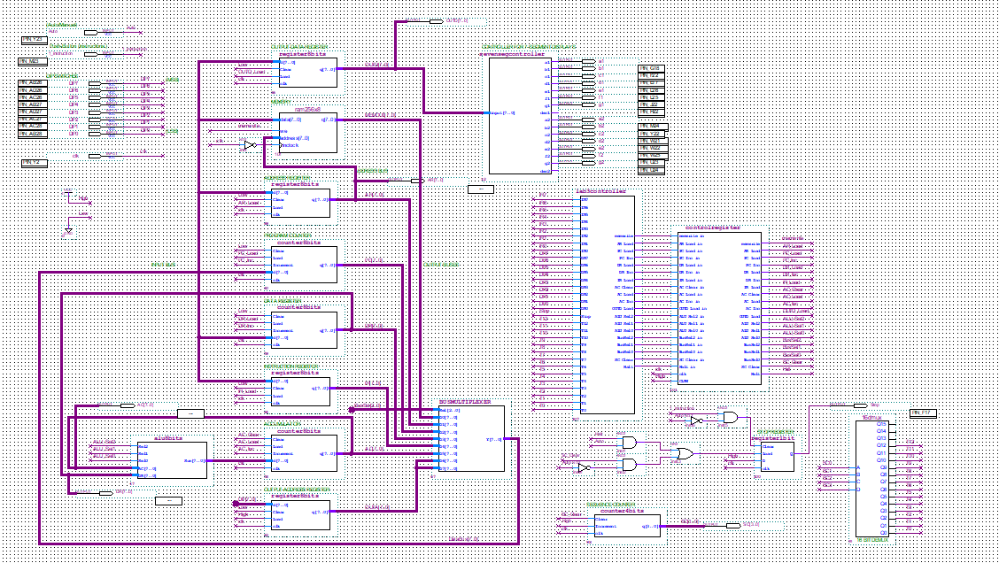
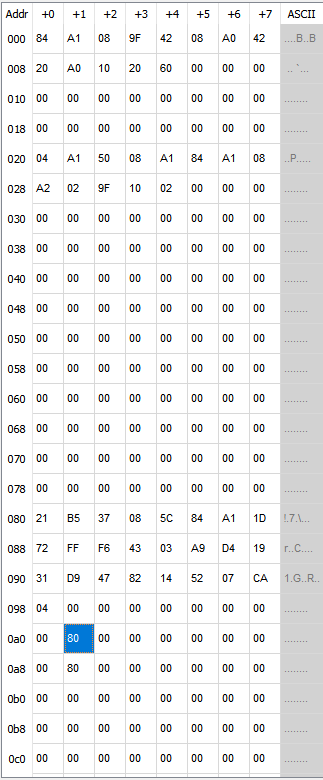

# Basic-Computer-CPU
CPU created using an Arithmetic Logic Unit as well as memory units for my computer architecture class. Here is the general view of the compononents put together.

# Components used

**Sequence counter (SC):** 

The sequence counter generates timing signals (T0, T1, T2, etc.) to synchronize operations within the control unit. 

**Instruction decoder:** 

The instruction decoder decodes the opcode form the instruction register (IR) and the outputs activate the corresponding control signals required for each instruction. 

**Registers:** 

  Instruction Register (IR): Stores the instruction that has been fetched for execution. 

  Data Register (DR): Temporarily holds operand data that is read from memory. 

  Program Counter (PC): Maintains the address of the upcoming instruction to be executed. 
 
**Arithmetic logic unit (ALU):** 

The ALU executes arithmetic and logical operations such as ADD, SUB, AND, and ISZ. It is designed as a combinational circuit, using multiplexers (MUXs) to select the operation based on control signals from the instruction decoder. 

**Memory (RAM):** 

A 256x8-bit memory stores both instructions and data, allowing for read and write operations. It employs a dual-read cycle to fetch instructions.” 

**7-Segment display:** 

The 7-segment display shows the memory content in hexadecimal format. A hex-to-7-segment decoder circuit is used to convert the memory data into signals suitable for display. 

**Memory content layout**

| Address  | Content                                                                                                                                      |
|----------|----------------------------------------------------------------------------------------------------------------------------------------------|
| 80 – 98  | 21, B5, 37, 08, 5C, 84, A1, 1D, 72, FF, F6, 43, 03, A9, D4, 19, 31, D9, 47, 82, 14, 52, 07, CA, 04                                           |
| 9F       | Temporary storage for the running sum.                                                                                                       |
| A0       | Complement of the running sum used for halting condition.                                                                                    |
| A1       | Pointer to the current number in the sequence (initialized to 80).                                                                           |
| A2       | Stores the last number added before halting.                                                                                                 |

**pictures of the CPU elements**:
Memory adress blocks and values:

